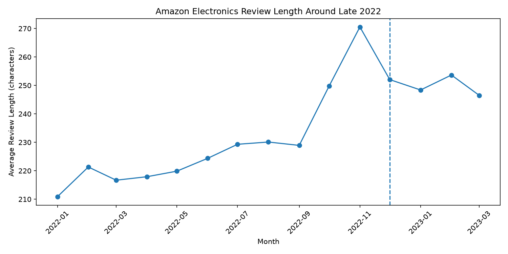
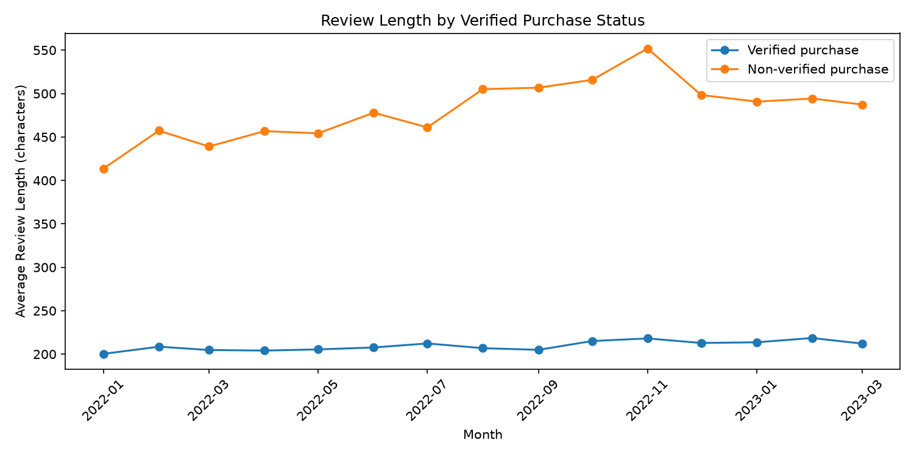
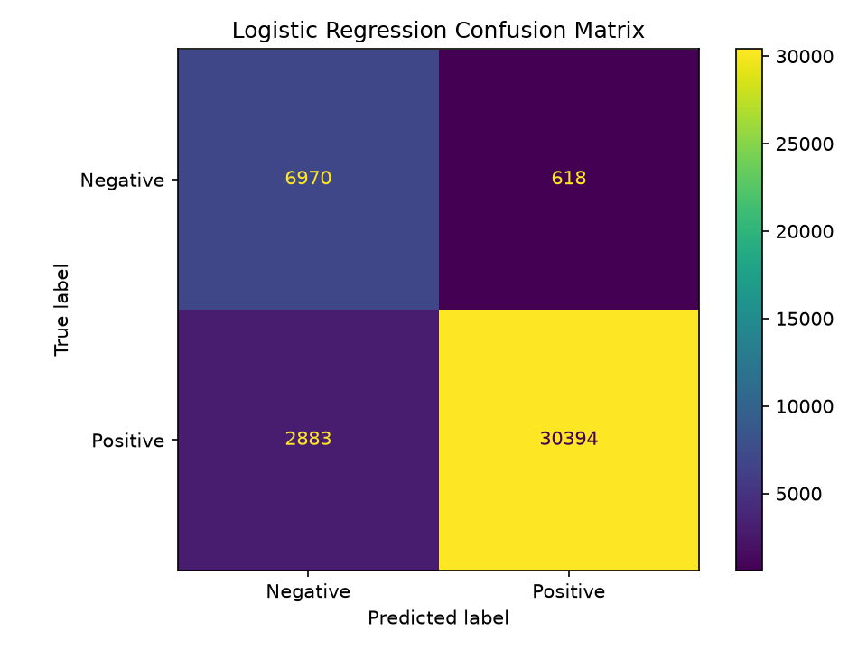

# Amazon Electronics Review Trends Around the Rise of Generative AI

## Project Goal

This project explores how Amazon Electronics reviews changed over time, with a closer look at the period around late 2022 when generative AI started becoming widely available. I was mainly interested in whether there was a noticeable change in review length around this period and whether other factors in the data could help explain the pattern.

The project is exploratory. I am not trying to show that generative AI caused a change in Amazon reviews. I use the timing only as a point of comparison and then look at what the data actually shows. I also use both Pandas and Polars for part of the analysis and experiment with a simple machine learning model for review sentiment.

## Dataset

The data comes from the Amazon Reviews'23 dataset collected by the McAuley Lab at UCSD. I used the Electronics category. My downloaded review file contains 43,886,944 reviews from 18,286,191 users and 1,609,860 products. The review timestamps range from November 1996 to September 2023.

The original Electronics review file is a compressed JSONL file of about 6.5 GB. Because the raw data and the processed Parquet files are too large for this repository, they are excluded with `.gitignore`. To reproduce the project, the Electronics review file from Amazon Reviews'23 should be placed at:

`data/raw/Electronics.jsonl.gz`

The main dataset source is **Amazon Reviews'23, McAuley Lab, UCSD**. I also referred to the accompanying dataset paper, **Hou et al., "Bridging Language and Items for Retrieval and Recommendation: Benchmarking LLMs as Semantic Encoders," arXiv:2403.03952**, for information about how the dataset was collected.

## Setup

The project uses Python 3.11 or newer. On Windows, create and activate a virtual environment with:

```powershell
python -m venv .venv
.venv\Scripts\activate
```

Install the dependencies with:

```powershell
pip install -r requirements.txt
```

The raw review data needs to be converted to Parquet before running the main analysis. Run:

```powershell
python preprocess.py
```

After preprocessing finishes, run:

```powershell
python analysis.py
```

The analysis script prints the main statistics and model results to the terminal and saves the plots in the `figures` folder.

## Data Preparation and Inspection

The original review data is stored as compressed JSONL. Since the full dataset contains almost 44 million reviews, I did not load the entire raw file into Pandas at once. Instead, `preprocess.py` reads the file in batches and writes the selected fields to Parquet. The full analysis file keeps information such as rating, product ID, user ID, timestamp, helpful votes, verified-purchase status, and review length. A separate reproducible sample keeps the original review text for the machine learning experiment.

For basic inspection, I used a 200,000-row subset with Pandas and ran `head()`, `info()`, and `describe()`. I also checked missing values and duplicate-looking rows. The inspection sample did not contain missing values in the selected columns. It contained 146 duplicate-looking rows, but I did not automatically remove them because the processed table does not include every field from the original review, such as the review title and full review text.

I also checked the valid rating range on the complete dataset. The Amazon Reviews'23 documentation defines ratings from 1 to 5, but I found two records with a rating of 0. These two records were removed before the main analysis.

## Filtering and Grouping

For the longer-term comparison, I filtered the data to reviews from 2018 through 2022 and grouped them by year. For each year, I calculated review count, average rating, positive-review rate, verified-purchase rate, average review length, average helpful votes, unique reviewers, and unique products.

I then looked more closely at January 2022 through March 2023 by grouping the data by month. I originally planned to use all of 2023, but the number of available reviews drops sharply after March. The dataset paper explains that the data was collected through a user-centered sampling process and that recently posted reviews may be missing near the dataset cutoff. Because of this, I did not treat later 2023 as a complete period for the main comparison.

## Review Length Results

Average review length was fairly stable from 2018 through 2021 and then increased noticeably in 2022.

| Year | Average Review Length |
| --- | ---: |
| 2018 | 197.2 |
| 2019 | 193.6 |
| 2020 | 202.9 |
| 2021 | 201.8 |
| 2022 | 231.4 |

Looking month by month shows more detail. Average review length was about 211 characters in January 2022, rose gradually during the year, reached about 250 characters in October, and peaked at about 271 characters in November. It then remained around the mid-240s to low-250s through March 2023.



The timing is important. The increase was already underway before the end of November 2022, so the data does not support a simple explanation that reviews suddenly became longer only after generative AI became widely available.

## Verified and Non-Verified Reviews

While looking at the monthly results, I noticed that the percentage of verified-purchase reviews was also changing. In January 2022, about 95% of the reviews were verified purchases. By November 2022, the rate had fallen to about 84%.

The two groups also had very different review lengths. In January, verified reviews averaged about 200 characters while non-verified reviews averaged about 414 characters. In November, the averages were about 218 and 552 characters respectively.



This suggests that part of the increase in overall review length came from a change in the mix of verified and non-verified reviews. However, the average length also increased within both groups. Verified reviews increased from about 200 to 218 characters between January and November, while non-verified reviews increased from about 414 to 552 characters. The overall increase therefore cannot be explained only by the changing proportion of the two groups.

## Pandas and Polars

I used Polars LazyFrame for the full dataset because it allowed me to work with the large Parquet file without immediately loading every row into memory. I also compared Pandas and Polars on the same group-by operation using 5 million rows.

To make the timing less dependent on a single run, I first ran a warm-up and then timed each implementation five times. On my machine, the median runtime was about 0.098 seconds for Pandas and 0.030 seconds for Polars.

Polars was faster in this particular test, although this is only one operation on one machine and should not be interpreted as showing that Polars is always faster than Pandas.

## Machine Learning Exploration

For the machine learning part, I used review text to predict whether a review was positive or negative. Reviews with 1 or 2 stars were treated as negative, reviews with 4 or 5 stars were treated as positive, and 3-star reviews were excluded. After removing empty review text, the machine learning sample contained 204,324 reviews.

I used TF-IDF to turn the review text into numeric features and Logistic Regression for classification. The data was split into 80% training and 20% testing. Because there were many more positive reviews than negative reviews, I used balanced class weights when training the model.

The model reached about 91.4% accuracy on the test set. For negative reviews, precision was 0.71, recall was 0.92, and F1 was 0.80. For positive reviews, precision was 0.98, recall was 0.91, and F1 was 0.95.



The model also gives a simple way to see what it learned from the text. Some of the words with the strongest positive weights were `great`, `love`, `perfect`, `amazing`, `easy`, and `excellent`. Some of the strongest negative words were `not`, `useless`, `poor`, `waste`, `terrible`, and `disappointed`. These words were not manually labeled as positive or negative. The model learned their relationships with the star-rating labels from the training data.

## Limitations

The main limitation is that this analysis cannot determine whether generative AI caused any of the changes in review behavior. Review length had already started increasing before the end of November 2022, and several other things in the data were changing at the same time, including the proportion of verified purchases.

The dataset itself also has a coverage limitation. The Amazon Reviews'23 authors explain that users were sampled first and their review histories were then collected. This means coverage for an individual product may be incomplete if some reviewers were not part of the sampled user pool. They also note that recently posted reviews may be missing near the dataset cutoff. In my Electronics data, monthly review counts begin dropping sharply after March 2023, so I did not use those later months for the main trend comparison.

Finally, review length is a very simple text measure. A longer review does not mean that it was written by AI, that it is higher quality, or that it is more useful. The results only show changes in observable review patterns around this period.

## Project Files

`analysis.py` contains the main analysis, Pandas and Polars comparison, visualizations, and machine learning experiment. `preprocess.py` converts the original JSONL data into Parquet and creates the text sample used for machine learning. The `figures` folder contains the generated plots, and `notebooks/rust_vs_python_intro.ipynb` contains the Rust exercises for the second part of the assignment.