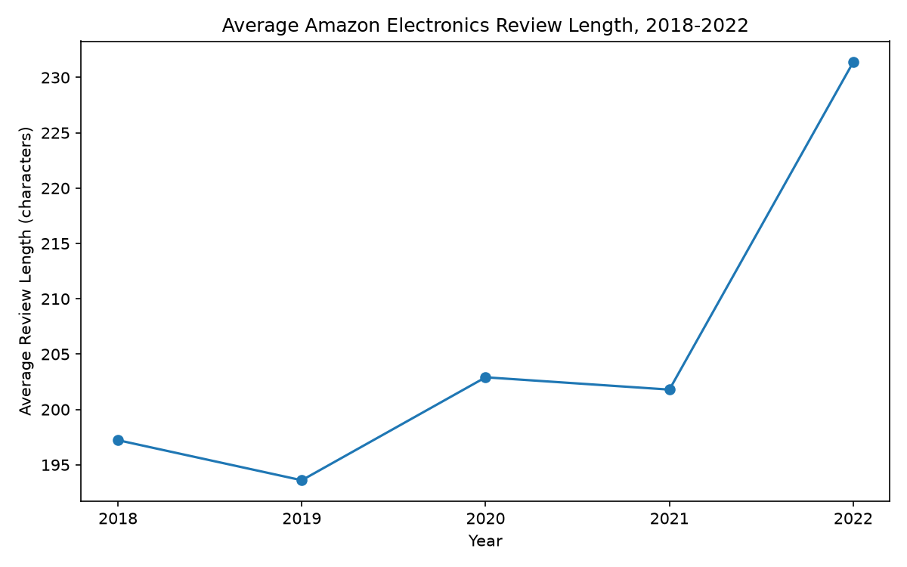
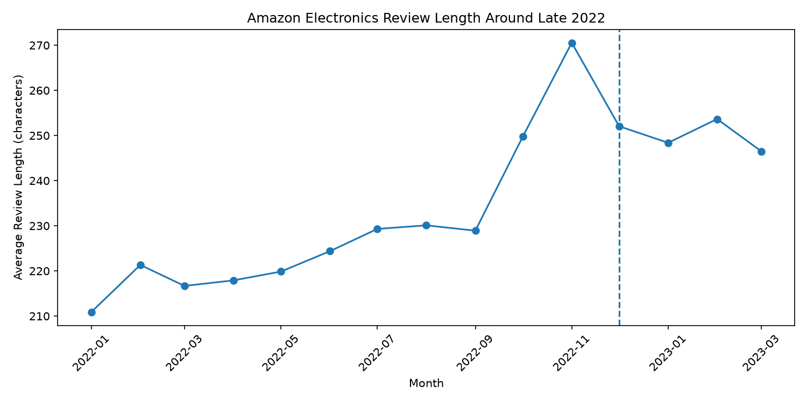
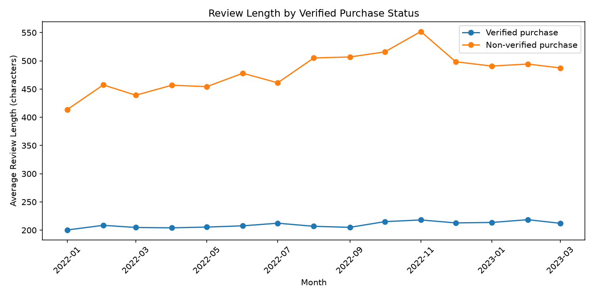
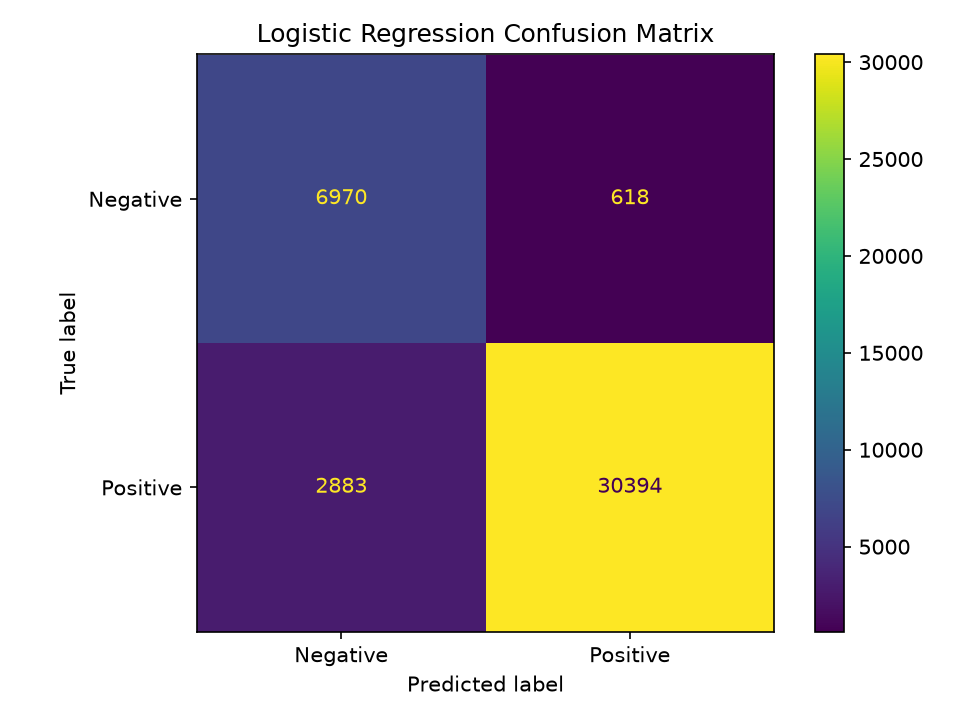
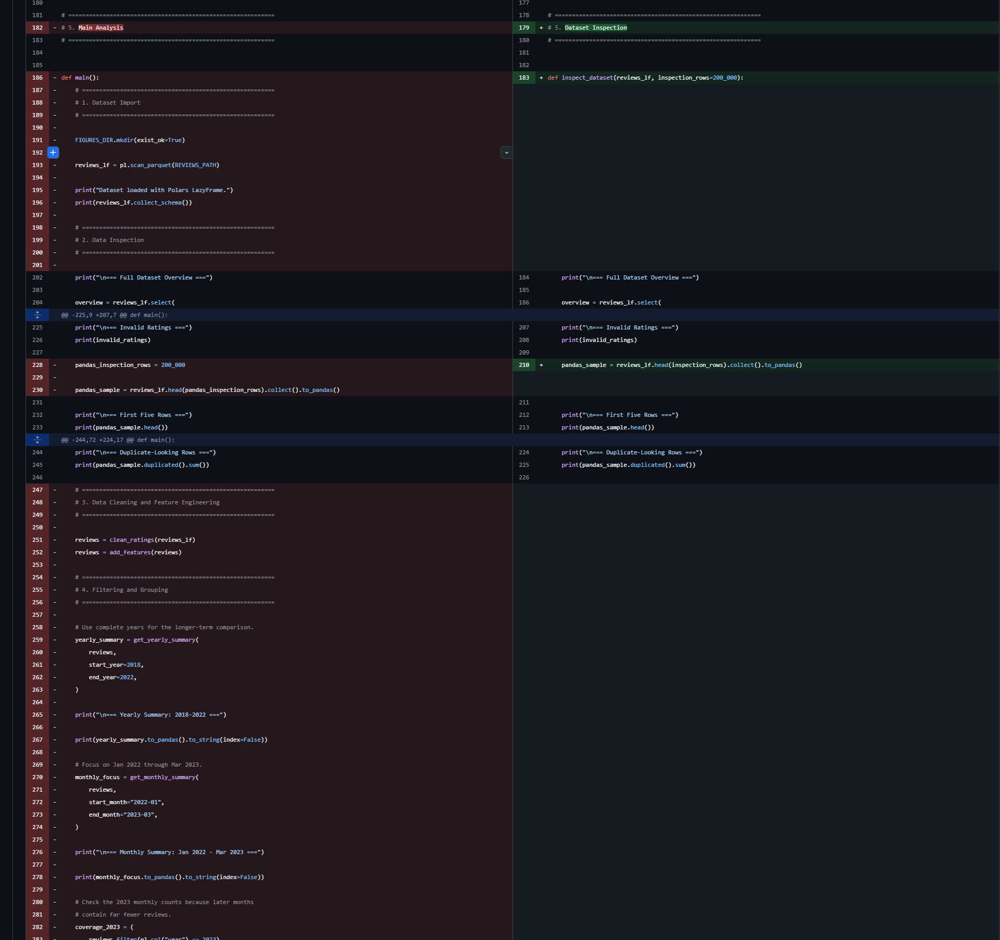
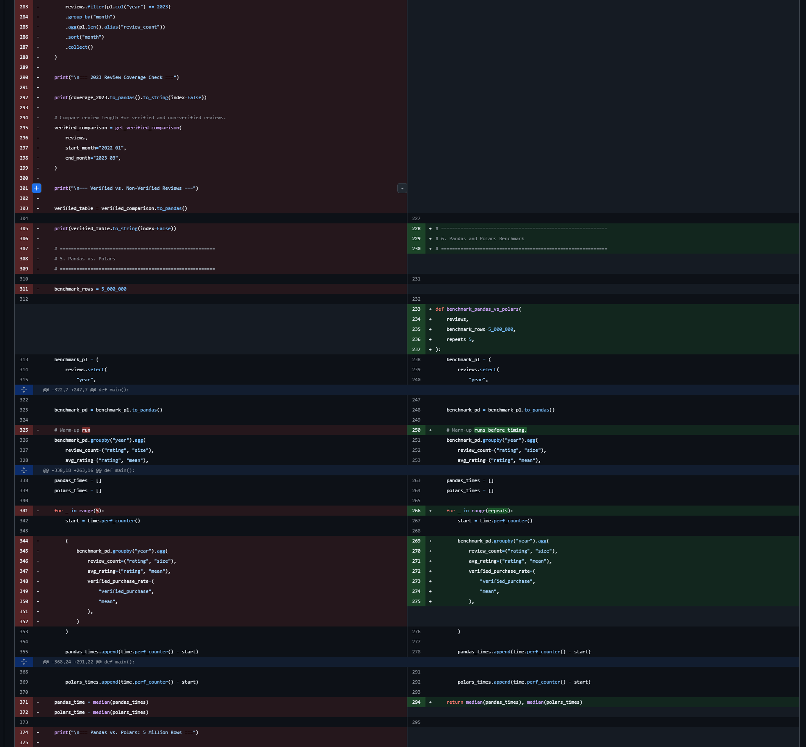
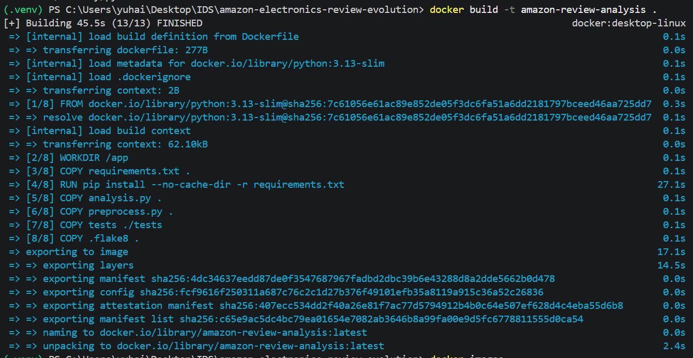
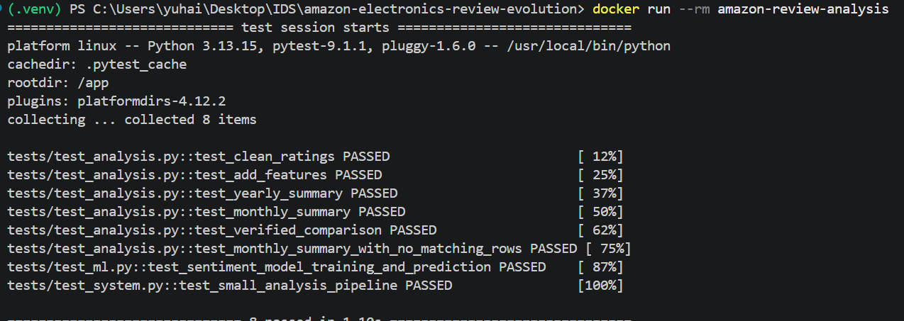

# Amazon Electronics Review Trends Around the Rise of Generative AI

*Refactor before the code starts fighting back.*

[](https://github.com/USERZEROA/amazon-electronics-review-evolution/actions/workflows/tests.yml)

## Project Goal

This project looks at how Amazon Electronics reviews changed over time, with a closer look at late 2022 when generative AI started becoming widely available.

I was mainly interested in review length. I also checked whether changes in verified purchase status could help explain the pattern. The project is exploratory. I am not trying to show that generative AI caused changes in Amazon reviews.

## Dataset

The data comes from the Amazon Reviews'23 dataset from the McAuley Lab at UCSD. I used the Electronics category.

My downloaded review file contains 43,886,944 reviews from 18,286,191 users and 1,609,860 products. The timestamps range from November 1996 to September 2023.

The original review file is about 6.5 GB, so the raw and processed data files are not stored in this repository. To reproduce the project, place the Electronics review file at:

`data/raw/Electronics.jsonl.gz`

I also referred to the Amazon Reviews'23 dataset paper for information about the collection process and the limitations near the end of the dataset.

## Setup

The project uses Python 3.11 or newer.

On Windows:

```powershell
python -m venv .venv
.venv\Scripts\activate
pip install -r requirements.txt
```

Preprocess the raw review file:

```powershell
python preprocess.py
```

Run the analysis:

```powershell
python analysis.py
```

The preprocessing script converts the large JSONL file to Parquet and creates a reproducible text sample for the machine learning experiment. The analysis script prints the main results and saves plots in the `figures` folder.

## Data Preparation

The full raw file is too large to load into Pandas at once, so `preprocess.py` reads it in batches with PyArrow and writes the selected fields to Parquet.

For inspection, I used a 200,000 row sample with Pandas and checked `head()`, `info()`, `describe()`, missing values, and duplicate looking rows. There were no missing values in the selected columns of that sample.

The documented rating range is 1 to 5, but the full dataset contained two records with a rating of 0. I removed those two records before the main analysis.

I also inspected large values in review length and helpful votes. I did not automatically remove them because a long review or a review with many helpful votes can still be a valid observation.

## Analysis and Findings

For the longer term comparison, I grouped reviews from 2018 through 2022 by year. Average review length stayed fairly stable through 2021 and increased in 2022.

| Year | Average Review Length |
| --- | ---: |
| 2018 | 197.2 |
| 2019 | 193.6 |
| 2020 | 202.9 |
| 2021 | 201.8 |
| 2022 | 231.4 |



I then looked at January 2022 through March 2023 month by month. Average review length was about 211 characters in January 2022 and reached about 271 characters in November.



The increase had already started before the end of November 2022. Because of that, the data does not support a simple explanation that reviews suddenly became longer only after generative AI became widely available.

I also noticed that the share of verified purchase reviews changed during the same period. It was about 95% in January 2022 and about 84% in November.

Non verified reviews were much longer on average, but review length also increased inside both groups.



This means the changing mix of verified and non verified reviews explains part of the overall pattern, but not all of it.

I did not use the later months of 2023 for the main comparison because review counts fall sharply after March. The dataset paper notes that recently posted reviews may be missing near the dataset cutoff.

## Machine Learning

I used review text to predict whether a review was positive or negative.

Reviews with 1 or 2 stars were treated as negative. Reviews with 4 or 5 stars were treated as positive. Three star reviews were excluded.

The model uses TF-IDF features and Logistic Regression. The data was split into 80% training and 20% testing, with balanced class weights because the sample contains many more positive reviews.

After removing empty text, the sample contained 204,324 reviews. The model reached about 91.4% test accuracy.



Some of the strongest positive terms included `great`, `love`, `perfect`, `amazing`, and `excellent`. Strong negative terms included `not`, `useless`, `poor`, `waste`, and `terrible`.

## Pandas and Polars

The full analysis uses Polars LazyFrame because the processed dataset is large.

I also ran the same group by operation on 5 million rows with both Pandas and Polars. After a warm up, I timed each version five times and compared the median runtime.

On my machine, Pandas took about 0.09 to 0.10 seconds and Polars about 0.03 seconds for this operation. This only describes this specific benchmark and should not be treated as a general claim that Polars is always faster.

## Key Takeaways

Amazon Electronics reviews became noticeably longer during 2022, but the increase started before the public release of ChatGPT.

Part of the change happened while the proportion of verified purchase reviews was falling. However, review length also increased within both verified and non verified reviews.

The project also showed that the same analysis workflow can be tested on small synthetic data, checked automatically in CI, and reproduced inside a Docker container without including the multi gigabyte Amazon dataset.

## Testing and Continuous Integration

The project contains eight automated tests. Seven are unit tests and one is an integration test.

The tests cover rating cleaning, feature creation, yearly and monthly aggregation, verified purchase comparisons, the machine learning workflow, an empty result edge case, and a small end to end Parquet analysis pipeline.

Run them locally with:

```bash
python -m pytest -v
```

GitHub Actions runs the checks on every push and pull request. It also supports manual runs and a weekly scheduled run.

The workflow tests Python 3.11 and Python 3.13. Each job runs Black, flake8, and pytest.

## Refactoring and Code Quality

The earlier version of `analysis.py` placed dataset inspection, benchmarking, plotting, and machine learning output inside one large `main()` function.

I split these parts into focused functions:

- `inspect_dataset()`
- `benchmark_pandas_vs_polars()`
- `create_review_figures()`
- `run_ml_experiment()`

This made `main()` easier to read and made the benchmark settings reusable instead of leaving them inside one large block.

After the refactor, I ran Black and flake8, reran all eight tests, and ran the complete analysis again. The analysis results and the sentiment model accuracy remained unchanged.

### Main Workflow Refactoring



### Benchmark Refactoring



## Docker

The project also includes a Dockerfile so the test environment can be reproduced without depending on my local Python setup.

Build the image with:

```bash
docker build -t amazon-review-analysis .
```

Run it with:

```bash
docker run --rm amazon-review-analysis
```

The container uses Python 3.13 on Linux and runs the complete pytest suite. All eight tests pass inside the container.

The large Amazon data files are intentionally kept outside the image. This helped separate the reproducible test environment from the multi gigabyte dataset. The container can still verify the analysis logic using the small synthetic test data.

### Docker Build



### Docker Run



## Limitations

This project cannot determine whether generative AI caused the changes in review behavior. Several patterns were changing at the same time, and review length had already started increasing before the end of November 2022.

The dataset also has coverage limitations near its cutoff. Review counts fall sharply after March 2023, so I did not use the later months for the main trend comparison.

Review length is also a simple measure. A longer review does not mean that it was written by AI or that it is better quality.

## Repository Structure

```text
amazon-electronics-review-evolution/
├── .github/
│   └── workflows/
│       └── tests.yml
├── data/
│   ├── raw/
│   ├── processed/
│   └── README.md
├── docs/
│   └── screenshots/
│       ├── docker-build.png
│       ├── docker-run.png
│       ├── refactoring-main-diff.png
│       └── refactoring-benchmark-diff.png
├── figures/
│   ├── confusion_matrix.png
│   ├── monthly_review_length.png
│   ├── review_length_by_year.png
│   └── verified_review_length.png
├── notebooks/
│   └── rust_vs_python_intro.ipynb
├── tests/
│   ├── test_analysis.py
│   ├── test_ml.py
│   └── test_system.py
├── .dockerignore
├── .flake8
├── .gitignore
├── Dockerfile
├── analysis.py
├── preprocess.py
├── README.md
└── requirements.txt
```